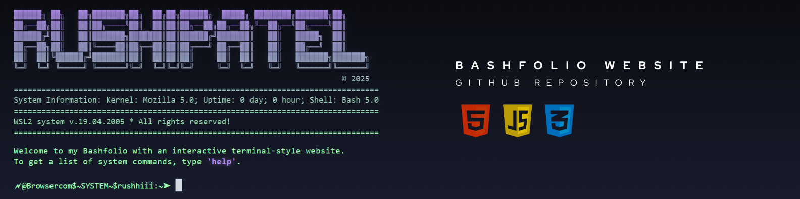
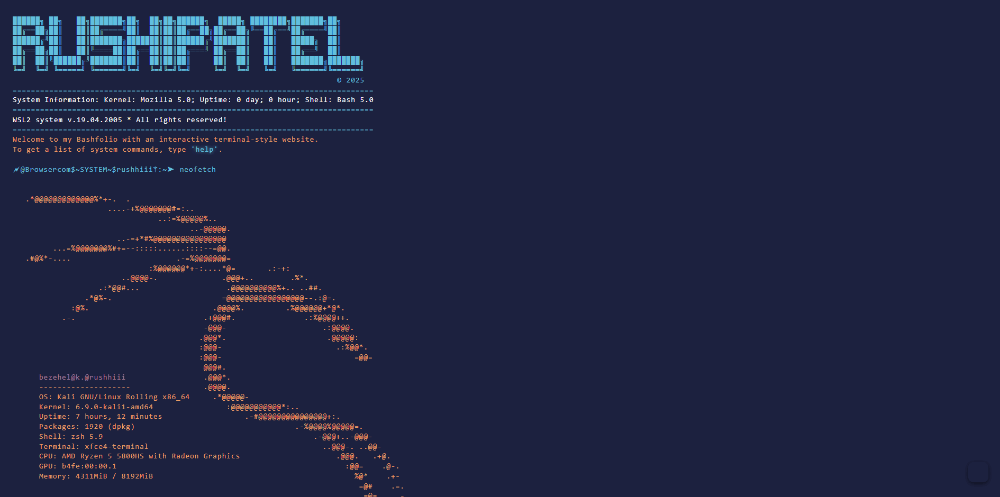

[](https://github.com/rushhiii/bashfolio)

<h1>⚡ Terminal Portfolio - Bashfolio</h1>

<h4>

A **terminal-style portfolio website** built entirely using HTML, CSS, and vanilla JavaScript. Inspired by Unix shells and Bash prompts, this site simulates a fully interactive CLI interface where visitors can run commands to learn more about me — like `whoami`, `projects`, `socials`, `email`, and more. Experience the nostalgia of command-line interfaces with modern web development.

</h4>

<a href="https://rushi-bashfolio.netlify.app" target="_blank"></a> <a href="https://github.com/rushhiii/Website-Portfolio" target="_blank"></a>


<div>
  <p>
    <br>
  </p>
</div>

>[!IMPORTANT]
>## ✯ Terminal Portfolio Features
>The Terminal Portfolio (Bashfolio) simulates a real Unix terminal experience with authentic command-line interface, interactive commands, realistic typing animations, and multiple color themes. It showcases modern web development techniques while providing a unique, retro computing experience that stands out from traditional portfolio websites.

### Technologies Used
This terminal portfolio leverages HTML5 for semantic structure, CSS3 for terminal styling and animations, and vanilla JavaScript for command processing and interactive functionality. It demonstrates pure web technologies without frameworks, creating an authentic terminal experience with modern web standards.

<a href="https://developer.mozilla.org/en-US/docs/Web/HTML" target="_blank">
  </a>
<a href="https://developer.mozilla.org/en-US/docs/Web/CSS" target="_blank">
  </a>
<a href="https://developer.mozilla.org/en-US/docs/Web/JavaScript" target="_blank">
  </a>
<a href="https://code.visualstudio.com/" target="_blank">
  </a>
<a href="https://git-scm.com/" target="_blank">
  </a>

<br>

### 🚀 Deployment Platforms & Hosting
Modern hosting platforms provide seamless deployment with features like automatic CI/CD, form handling, global CDN distribution, and performance optimization for terminal portfolio websites.

<a href="https://www.netlify.com/">
  </a>
<a href="https://vercel.com/">
  </a>
<a href="https://pages.github.com/">
  </a>

### 🖥️ Terminal Features
This repository features authentic terminal emulation with command history, tab completion, multiple color themes, realistic typing effects, and responsive design. It includes ASCII art display, system information commands, social media integration, and interactive command processing with error handling.

<br>
<br>


>[!IMPORTANT]
>## Terminal Commands & Features
>**Interactive Command Line Interface** — Experience authentic terminal interaction with a comprehensive set of commands. This terminal portfolio demonstrates real-world command-line functionality with modern web technologies, combining the power of HTML5, CSS3, and vanilla JavaScript for an immersive CLI experience.

### 🔥 Available Commands

| Command     | Description                                         |
|-------------|-----------------------------------------------------|
| `help`      | Displays all available commands                     |
| `whoami`    | Shows your name and intro bio                       |
| `socials`   | Displays your social media links                    |
| `projects`  | Lists your highlighted personal or academic projects |
| `email`     | Shows your contact email                            |
| `neofetch`  | Displays fun system info in neofetch-style layout   |
| `asciiart`  | Prints cool ASCII art                               |
| `sudo`      | Easter egg 😄                                       |
| `clear`     | Clears the screen                                   |
| `exit`      | Exits the simulated terminal                        |

#### 🎯 Terminal Command Demos

<a href="https://rushi-bashfolio.netlify.app" target="_blank">
  </a>

<a href="https://rushi-bashfolio.netlify.app" target="_blank">
  </a>

<a href="https://rushi-bashfolio.netlify.app" target="_blank">
  </a>

<a href="https://rushi-bashfolio.netlify.app" target="_blank">
  </a>

<a href="https://rushi-bashfolio.netlify.app" target="_blank">
  </a>

<a href="https://rushi-bashfolio.netlify.app" target="_blank">
  </a>

<div>
  <p>
    <h1></h1>
  </p>
</div>

- 🎨 **Multiple Color Themes**
  - Classic terminal themes: Green, Amber, Blue, Red, Pink
  - Dark mode optimized for extended use
  - Theme persistence across sessions
    #### 🎨 Terminal Themes & Customization
    
<a href="https://github.com/rushhiii/rushi-bashfolio/blob/main/css/green.css" target="_blank">
  </a>

<a href="https://github.com/rushhiii/rushi-bashfolio/blob/main/css/aurora.css" target="_blank">
  </a>

<a href="https://github.com/rushhiii/rushi-bashfolio/blob/main/css/pink.css" target="_blank">
  </a>

<a href="https://github.com/rushhiii/rushi-bashfolio/blob/main/css/espresso.css" target="_blank">
  </a>

<div>
  <p>
    <h1></h1>
  </p>
</div>

- ⚡ **Terminal Features**
  - Realistic typing animations and caret blinking
  - Command history navigation with arrow keys
  - Auto-completion and command suggestions
  - Responsive design for all devices
    #### ⚡ Interactive Terminal Features
    
<a href="https://github.com/rushhiii/rushi-bashfolio/blob/main/js/caret.js" target="_blank">
  </a>

<a href="https://github.com/rushhiii/rushi-bashfolio/blob/main/js/main.js" target="_blank">
  </a>

<a href="https://github.com/rushhiii/rushi-bashfolio/blob/main/js/command.js" target="_blank">
  </a>

<a href="https://github.com/rushhiii/rushi-bashfolio/blob/main/css/" target="_blank">
  </a>
    
<div>
  <p>
    <h1></h1>
  </p>
</div>

- 🌐 **Pure Web Technologies**
  - No frameworks or dependencies required
  - Vanilla JavaScript for optimal performance
  - CSS3 animations and transitions
  - HTML5 semantic structure

[](https://rushi-bashfolio.netlify.app)
<p>
 This terminal portfolio project showcases authentic command-line interface simulation using pure web technologies. The website features realistic terminal behavior, interactive commands, and multiple themes that demonstrate advanced CSS and JavaScript skills. Perfect for developers who want to create a unique, memorable portfolio experience.
 <br>

⚠️ <b>Note:</b> This is a client-side terminal simulation. No actual system commands are executed for security reasons.
</p>

<a href="https://rushi-bashfolio.netlify.app/" target="_blank">
  
</a>

<br>


<h2>★ Terminal Development Resources</h2>

<h3>🧩 Core Terminal Technologies</h3>

1] <b>HTML5</b> – Semantic structure for terminal interface and accessibility<br>
2] <b>CSS3</b> – Terminal styling, animations, and responsive design<br>
3] <b>JavaScript ES6+</b> – Command processing and interactive functionality<br>
4] <b>Terminal Emulation</b> – Authentic CLI experience with web technologies<br>
5] <b>Animation APIs</b> – Smooth typing effects and transitions<br>
6] <b>Local Storage</b> – Theme persistence and user preferences<br>

<a href="https://developer.mozilla.org/en-US/docs/Web/HTML" target="_blank">
  </a>

<a href="https://developer.mozilla.org/en-US/docs/Web/CSS" target="_blank">
  </a>

<a href="https://developer.mozilla.org/en-US/docs/Web/JavaScript" target="_blank">
  </a>

<a href="https://developer.mozilla.org/en-US/docs/Web/API/Web_Animations_API" target="_blank">
  </a>

<a href="https://developer.mozilla.org/en-US/docs/Web/API/Window/localStorage" target="_blank">
  </a>

<a href="https://en.wikipedia.org/wiki/Terminal_emulator" target="_blank">
  </a>

<div>
  <p>
    <h1></h1>
  </p>
</div>

<h3>⚙️ Terminal Component Types</h3>

1] <b>Command Parser:</b> <br>
Processes user input, validates commands, and executes appropriate functions with error handling.<br>
2] <b>Output Renderer:</b><br>
Displays command results with proper formatting, colors, and animations in terminal style.<br>
3] <b>Theme Manager:</b><br>
Handles multiple color schemes, theme switching, and persistent user preferences.<br>
4] <b>Animation Engine:</b><br>
Controls typing effects, cursor blinking, and smooth transitions for realistic terminal feel.<br>

<div>
  <p>
    <h1></h1>
  </p>
</div>

<h3>🧰 Essential Development Tools</h3>

1] <b>VS Code</b> – Modern code editor with terminal integration – code.visualstudio.com <br>
2] <b>Git</b> – Version control for tracking development progress – git-scm.com <br>
3] <b>Chrome DevTools</b> – Browser tools for debugging terminal behavior <br>
4] <b>Live Server</b> – Local development server with hot reload <br>
5] <b>Netlify</b> – Modern hosting with instant deployment – netlify.com <br>
6] <b>Terminal Emulators</b> – Reference for authentic terminal behavior <br>
7] <b>ASCII Art Generators</b> – Tools for creating terminal art <br>
8] <b>Color Palette Tools</b> – Terminal theme color selection <br>

<a href="https://code.visualstudio.com/" target="_blank"> 
  </a> 

<a href="https://git-scm.com/" target="_blank"> 
  </a> 

<a href="https://developer.chrome.com/docs/devtools/" target="_blank"> 
  </a> 

<a href="https://marketplace.visualstudio.com/items?itemName=ritwickdey.LiveServer" target="_blank"> 
  </a>

<a href="https://www.netlify.com/" target="_blank"> 
  </a>

<a href="https://www.asciiart.eu/" target="_blank"> 
  </a> 

<a href="https://coolors.co/" target="_blank"> 
  </a>
  
<div>
  <p>
    <h1></h1>
  </p>
</div>

<h3>🛠️ Terminal Simulation Technologies</h3>

1] <b>Command Line Interface:</b> HTML structure, CSS styling, JavaScript processing <br>
2] <b>Text Animation:</b> CSS keyframes, JavaScript intervals, typing effects <br>
3] <b>Theme Systems:</b> CSS custom properties, local storage, dynamic styling <br>
4] <b>Interactive Elements:</b> Event listeners, keyboard navigation, command history <br>

<a href="https://developer.mozilla.org/en-US/docs/Web/API/KeyboardEvent" target="_blank">
  </a>
  
<a href="https://developer.mozilla.org/en-US/docs/Web/CSS/CSS_Animations" target="_blank">
  </a>

<a href="https://developer.mozilla.org/en-US/docs/Web/CSS/Using_CSS_custom_properties" target="_blank">
  </a>

<a href="https://developer.mozilla.org/en-US/docs/Web/API/EventTarget/addEventListener" target="_blank">
  </a>
  
<a href="https://developer.mozilla.org/en-US/docs/Web/API/History_API" target="_blank">
  </a>
  
<a href="https://developer.mozilla.org/en-US/docs/Web/API/Document_Object_Model" target="_blank">
  </a>

<div>
  <p>
    <h1></h1>
  </p>
</div>


## 📁 Project Structure

<details>
<summary>Click to expand file structure</summary>

```
Web-Bashfolio/
├── 📄 index.html              # Main terminal interface
├── 📜 LICENSE                 # MIT license
├── 📖 README.md              # Project documentation
├── 📁 assets/
│   ├── 🎨 palet.png          # Color palette reference
│   ├── 🎬 themes.gif         # Theme demonstration
│   └── 📊 themes_stack.png   # Theme stack overview
├── 📁 css/
│   ├── 🎨 academia.css       # Academic theme
│   ├── 🌅 aurora.css         # Aurora theme
│   ├── ⚫ b&w.css            # Black & white theme
│   ├── 🔵 default.css        # Default blue theme
│   ├── ☕ espresso.css       # Espresso dark theme
│   ├── 💚 green.css          # Classic green theme
│   ├── 💖 pink.css           # Retro pink theme
│   └── ⚙️ set_theme.css      # Theme management
├── 📁 js/
│   ├── 🔶 caret.js           # Terminal cursor animation
│   ├── ⚡ command.js         # Command processing logic
│   └── 🎮 main.js            # Main application logic
├── 📁 prvt/                  # Private development files
│   ├── 🌅 aurorav1.css       # Aurora theme v1
│   ├── 📝 backup.md          # Development backup
│   ├── 🔶 caret.js           # Caret backup
│   ├── ⚡ command.js         # Command backup
│   ├── 📄 index.html         # Index backup
│   ├── 🎮 main.js            # Main backup
│   ├── 🎨 style.css          # Style backup
│   └── 🧪 temp.css           # Temporary styles
└── 📁 Tutorial/              # Step-by-step guides
    ├── 📘 01_terminal_core_ui_.md
    ├── 📘 02_user_input___typing_handler_.md
    ├── 📘 03_command_interpreter_.md
    ├── 📘 04_command_output_data_.md
    ├── 📘 05_output_rendering_engine_.md
    ├── 📘 06_theme_management_.md
    └── 📖 README.md          # Tutorial overview
```

</details>

## 🚀 Quick Start - Deploy Your Own Copy!


### 🎯 **Option 1: Fork & Deploy (Recommended for Beginners)**

**Get your own terminal portfolio live in under 2 minutes!**

1. **🍴 Fork this repository**
   - Click the "Fork" button at the top of this page
   - This creates your own copy of the project

2. **🚀 Deploy instantly to Netlify**
   [](https://app.netlify.com/start/deploy?repository=https://github.com/rushhiii/rushi-bashfolio)
   - Click the "Deploy to Netlify" button above
   - Connect your GitHub account
   - Select your forked repository
   - Your site will be live in minutes!

3. **✏️ Customize later**
   - Edit files directly on GitHub or clone locally
   - Netlify will automatically redeploy when you make changes
   - Follow the customization guide below to personalize it

### 💡 **Learn How It Works - Tutorial Series**

Want to understand how this terminal portfolio was built? Check out our comprehensive tutorial series:

📚 **[Tutorial Folder](./Tutorial/)** - Step-by-step guides covering:

<a href="./Tutorial/README.md" target="_blank">
  </a>

<a href="./Tutorial/01_terminal_core_ui_.md" target="_blank">
  </a>

<a href="./Tutorial/02_user_input___typing_handler_.md" target="_blank">
  </a>

<a href="./Tutorial/03_command_interpreter_.md" target="_blank">
  </a>

<a href="./Tutorial/04_command_output_data_.md" target="_blank">
  </a>

<a href="./Tutorial/05_output_rendering_engine_.md" target="_blank">
  </a>

<a href="./Tutorial/06_theme_management_.md" target="_blank">
  </a>

**Perfect for:**
- 🎓 Learning terminal emulation with web technologies
- 💻 Understanding vanilla JavaScript project structure
- 🎨 Creating your own terminal-style portfolio
- 📚 Web development educational purposes

### 🛠️ **Option 2: Local Development Setup**


### Prerequisites
- Web browser (Chrome, Firefox, Safari, Edge)
- Code editor (VS Code recommended)
- Git (for version control)
- Basic understanding of HTML, CSS, and JavaScript

### Local Development

1. **Clone your forked repository** (or this one)
   ```bash
   git clone https://github.com/YOUR-USERNAME/rushi-bashfolio.git
   cd rushi-bashfolio
   ```

2. **Open in your browser**
   - Simply open `index.html` in your web browser
   - Or use a local server for better development experience:
   ```bash
   # Using Python
   python -m http.server 8000
   
   # Using Node.js
   npx serve .
   
   # Using VS Code Live Server extension
   # Right-click on index.html → "Open with Live Server"
   ```

3. **View the terminal**
   - Open `http://localhost:8000` in your browser
   - Start typing commands like `help`, `whoami`, `projects`

## 🌐 Deployment Options


### 🔵 Netlify (Recommended - Free)

**For your forked repository:**
1. Go to [Netlify](https://netlify.com)
2. Click "New site from Git"
3. Connect your GitHub account
4. Select your forked `rushi-bashfolio` repository
5. Deploy settings:
   - Build command: (leave empty)
   - Publish directory: (leave empty or set to root)
6. Click "Deploy site"

**One-click deploy:**
[](https://app.netlify.com/start/deploy?repository=https://github.com/rushhiii/rushi-bashfolio)

### 🟠 Vercel (Free)
1. Go to [Vercel](https://vercel.com)
2. Import your forked GitHub repository
3. Deploy with default settings

### ⚫ GitHub Pages (Free)
1. In your forked repository settings
2. Go to "Pages" section
3. Source: Deploy from branch → `main`
4. Your site will be available at: `https://YOUR-USERNAME.github.io/rushi-bashfolio`

### 🔴 Firebase Hosting (Free tier available)
1. Install Firebase CLI: `npm install -g firebase-tools`
2. Run `firebase init hosting` in your project directory
3. Deploy with `firebase deploy`


## 🎨 Customization Guide


### 🎯 **Quick Customization Checklist**

After forking and deploying, personalize your terminal portfolio:

- [ ] Update personal information in `js/command.js`
- [ ] Replace projects with your own work
- [ ] Change social media links to yours
- [ ] Update contact email
- [ ] Modify the welcome message
- [ ] Add your own ASCII art
- [ ] Choose your preferred theme
- [ ] Update the page title in `index.html`

<details>
<summary>📝 Personalizing Content</summary>

### Updating Personal Information
Edit the command outputs in `js/command.js`:

**1. Update `whoami` command:**
```javascript
whoami: {
  description: "Display current user information",
  output: () => {
    return `
guest@portfolio:~$ whoami
Your Name Here
Student | Developer | Your Title

Your bio and introduction here...
    `;
  }
}
```

**2. Modify `projects` command:**
```javascript
projects: {
  description: "Display portfolio projects",
  output: () => {
    return `
🚀 Your Amazing Project
   Description of your project
   [Tech: React, Node.js, MongoDB]
   
🎮 Another Cool Project  
   What this project does
   [Tech: JavaScript, CSS, HTML]
    `;
  }
}
```

**3. Change `socials` command:**
```javascript
socials: {
  description: "Display social media links",
  output: () => {
    return `
📱 Social Media Links:
   GitHub: https://github.com/yourusername
   LinkedIn: https://linkedin.com/in/yourprofile
   Twitter: https://twitter.com/yourhandle
    `;
  }
}
```

**4. Update `email` command:**
```javascript
email: {
  description: "Display contact email",
  output: () => {
    return `📧 Contact: your.email@example.com`;
  }
}
```

</details>

<details>
<summary>🎨 Adding New Commands</summary>

### Creating Custom Commands
Add new commands in `js/command.js`:
```javascript
// Add to the commands object
commands: {
  // ... existing commands
  resume: {
    description: "Download my resume",
    output: () => {
      window.open('./assets/your-resume.pdf', '_blank');
      return "📄 Opening resume in new tab...";
    }
  },
  
  skills: {
    description: "Display technical skills",
    output: () => {
      return `
💻 Technical Skills:
   Languages: JavaScript, Python, Java
   Frontend: React, Vue.js, HTML/CSS
   Backend: Node.js, Express, MongoDB
   Tools: Git, Docker, VS Code
      `;
    }
  }
}
```

</details>

<details>
<summary>🎨 Theme Customization</summary>

### Using Existing Themes
Switch between pre-built themes by changing the CSS import in `index.html`:
```html
<!-- Choose one of these themes -->
<link rel="stylesheet" href="css/green.css">     <!-- Classic green -->
<link rel="stylesheet" href="css/aurora.css">   <!-- Aurora blue -->
<link rel="stylesheet" href="css/pink.css">     <!-- Retro pink -->
<link rel="stylesheet" href="css/espresso.css"> <!-- Dark espresso -->
```

### Creating New Themes
Create a new CSS file in the `css/` directory:
```css
/* css/mytheme.css */
:root {
  --primary-color: #your-primary-color;
  --secondary-color: #your-secondary-color;
  --background-color: #your-background;
  --text-color: #your-text-color;
  --accent-color: #your-accent-color;
}
```

</details>

<details>
<summary>📚 Learning from Tutorials</summary>

### Follow the Tutorial Series
Learn how each component works by following our tutorial series in the `Tutorial/` folder:

1. **[Overview](./Tutorial/README.md)** - Project architecture and concepts
2. **[Terminal Core UI](./Tutorial/01_terminal_core_ui_.md)** - Building the terminal interface
3. **[User Input & Typing Handler](./Tutorial/02_user_input___typing_handler_.md)** - Handling user interactions
4. **[Command Interpreter](./Tutorial/03_command_interpreter_.md)** - Processing commands
5. **[Command Output Data](./Tutorial/04_command_output_data_.md)** - Managing command responses
6. **[Output Rendering Engine](./Tutorial/05_output_rendering_engine_.md)** - Displaying results
7. **[Theme Management](./Tutorial/06_theme_management_.md)** - Creating and switching themes

**Perfect for:**
- Understanding the codebase structure
- Learning terminal emulation concepts
- Building your own commands and features
- Exploring advanced customization options

</details>

## 🤝 Contributing


We welcome contributions! Here's how you can help:

1. **Fork** the repository
2. **Create** a feature branch (`git checkout -b feature/new-command`)
3. **Add** your changes (new commands, themes, features)
4. **Test** your changes thoroughly
5. **Commit** your changes (`git commit -m 'Add new terminal command'`)
6. **Push** to the branch (`git push origin feature/new-command`)
7. **Open** a Pull Request

### Contribution Ideas
- 🎨 New terminal themes
- ⚡ Additional commands
- 🐛 Bug fixes and improvements
- 📚 Documentation updates
- 🌐 Accessibility enhancements

## Contact

📧 Email: rushiofficial1205@gmail.com  
💼 LinkedIn: [in/rushhiii](https://linkedin.com/in/rushhiii)  
🐙 GitHub: [@rushhiii](https://github.com/rushhiii)  
🌐 Portfolio: [rushi-bashfolio.netlify.app](https://rushi-bashfolio.netlify.app/)  
🖥️ Terminal Portfolio: [rushi-bashfolio.netlify.app](https://rushi-bashfolio.netlify.app/)

#

<p align="center">by <strong>@rushhiii</strong></p>