# Chapter 1: Terminal Core UI

Welcome to the first chapter of the Rushi-Bashfolio tutorial! We're going to start building your own interactive terminal-style website, and the very first step is setting up the foundational visual structure.

Think of a traditional computer terminal – it has a screen that displays information and a line at the bottom where you type commands. The "Terminal Core UI" is like the physical casing and screen of that terminal. It's the visual container that holds everything else.

In this chapter, we'll explore the basic HTML structure and CSS styling that creates this look and feel. By the end, you'll understand how the website creates the basic "terminal window" where all the action happens.

## What is the Terminal Core UI?

The Terminal Core UI is the **main visual framework** of the Bashfolio website. It's responsible for:

1.  **Providing a background:** Making the page look like a dark terminal screen.
2.  **Defining the display area:** Where previous commands and their outputs are shown.
3.  **Setting up the input area:** Where the user sees the prompt and types their current command.
4.  **Adding basic terminal-like styling:** Using monospace fonts, specific colors, and padding to mimic a real terminal.

Essentially, it's the empty stage where all the future interactions will play out.

## Setting the Stage: HTML Structure

Let's look at the fundamental parts of the `index.html` file that create this core structure. We'll simplify the code down to the essentials for the UI:

```html
<!DOCTYPE html>
<html lang="en">
<head>
    <!-- ... head content like title, meta tags ... -->
    <link rel="stylesheet" type="text/css" media="screen" href="css/aurora.css">
    <!-- ... other theme links, etc. ... -->
    <style>
        #liner::before {
            content: "🗲@Browsercom$~SYSTEM~$rushhiii:~➤ ";
        }
    </style>
</head>
<body>
    <div id="terminal">
        <!-- Output will appear here -->
        <a id="before"></a>
    </div>
    <div id="command">
        <!-- This is where user types -->
        <textarea type="text" id="texter" autofocus></textarea>
        <div id="liner">
            <span id="typer"></span><b class="cursor" id="cursor"></b>
        </div>
    </div>
    <!-- ... scripts and theme switcher ... -->
</body>
</html>
```

Here's a breakdown of the key parts for the Core UI:

| HTML Element     | Role in Terminal UI                          |
| :--------------- | :------------------------------------------- |
| `<body>`         | The entire page background and container     |
| `<div id="terminal">` | The main output area (the "screen")      |
| `<div id="command">` | The input line area (where you type)       |
| `<textarea id="texter">` | Hidden element to capture keyboard input |
| `<div id="liner">` | Container for the prompt and user input    |
| `<span id="typer">` | Displays the text the user has typed       |
| `<b class="cursor">` | The blinking cursor symbol               |

The `#terminal` div will eventually be filled with the output of commands. The `#command` div holds everything related to the *current* input line.

You might notice the `<textarea id="texter">`. This is a common trick in web terminals. A `<textarea>` is great for handling keyboard input (like pressing Enter, arrow keys, copy/paste), but styling it exactly like a terminal line with a blinking cursor can be tricky. So, we hide the `<textarea>` (`left: -1000px; position: absolute;` in CSS) and use JavaScript (covered in the next chapter, [User Input & Typing Handler](02_user_input___typing_handler_.md)) to copy the text from the hidden `<textarea>` into the visible `#typer` span and manage the `.cursor`. For now, just know it's there to help capture your typing!

The `style` block in the `<head>` sets the default prompt symbol (`🗲@Browsercom$~SYSTEM~$rushhiii:~➤ `). This is the text that appears before where you type your command.

## Making it Look Like a Terminal: CSS Styling

The HTML provides the structure, but CSS provides the look. Several CSS files (`css/aurora.css`, `css/espresso.css`, etc.) exist for different themes, but they all style the core elements (`body`, `#terminal`, `#command`, `#liner`, `.cursor`, `p`) in a similar way to achieve the terminal appearance.

Let's look at some simplified CSS snippets (using `css/aurora.css` as an example, but the concepts apply to all themes) that define the Core UI's appearance:

```css
/* From css/aurora.css */
body {
    margin: 0;
    padding: 15px 20px; /* Adds space around the terminal content */
    min-height: 100vh; /* Makes the body at least full screen height */
    width: 100%;
    color: #d0e7f9; /* Default text color */
    background: linear-gradient(180deg, #0b0c10 0%, #232946 100%); /* Background color/gradient */
    overflow-x: hidden; /* Prevents horizontal scrolling */
}

* {
    font-family: 'Fira Code', 'IBM Plex Mono', monospace !important; /* Use a terminal-style font */
    font-size: 12px; /* Set base font size */
    /* ... other global styles ... */
}
```
This CSS styles the `body` to be the main container with a dark background (or gradient, depending on the theme), sets the default text color, adds padding around the content, and ensures a monospace font is used, which is characteristic of terminals.

Now, let's look at the input line:

```css
/* From css/aurora.css */
#command {
    cursor: text; /* Show a text cursor when hovering */
    height: 50px; /* Give it some space */
    color: #d0e7f9; /* Text color for the input line */
    /* ... other styles ... */
}

#liner {
    line-height: 1.3rem; /* Spacing between lines */
    margin-top: -2px; /* Fine-tuning position */
    /* ... animation and opacity styles ... */
    color: #9fffb3; /* Color for the prompt symbol */
}

.cursor {
    font-size: 12px; /* Match base font size */
    color: #d0e7f9;
    background-color: #e0e7ef; /* Color of the blinking block */
    position: relative;
    /* ... sizing and alignment ... */
    animation: blinker 1s linear infinite; /* Animation to make it blink */
}

@keyframes blinker {
    50% {
        opacity: 0;
    }
}
```
These styles position the `#command` area, style the `#liner` which contains the prompt and typed text, and define the appearance and blinking animation for the `.cursor`.

And how about the output lines?

```css
/* From css/aurora.css */
p {
    display: block;
    line-height: 1.3em; /* Spacing for output lines */
    margin: 0;
    overflow: hidden;
    white-space: normal;
    letter-spacing: 0.05em;
    /* ... typing animation ... */
}
```
This styles the `<p>` tags that will be used to display command output, ensuring they fit within the terminal and have appropriate spacing.

By combining this HTML structure with the CSS styling, we create the visual shell – the Terminal Core UI. You can see this just by opening the `index.html` file in your browser; you'll see the dark background, the prompt line, and the blinking cursor, even before any JavaScript runs or any commands are entered.

## Under the Hood: How the Browser Renders the Core UI

When you open the `index.html` file in your web browser, here's a simplified sequence of what happens to set up the Core UI:

```mermaid
sequenceDiagram
    participant Browser
    participant index.html
    participant css/theme.css (Example)

    Browser->index.html: Request File
    index.html-->Browser: HTML Content Received
    Browser->index.html: Parse HTML
    index.html->Browser: Discover <link> for CSS
    Browser->css/theme.css (Example): Request CSS File
    css/theme.css (Example)-->Browser: CSS Content Received
    Browser->css/theme.css (Example): Parse CSS Rules
    Browser->index.html: Apply CSS styles to HTML elements
    Note over Browser: Styles like background, fonts, colors are applied.
    Note over Browser: Elements like #terminal, #command, #liner, .cursor are positioned and styled.
    Browser->Browser: Render the styled page
    Note over Browser: You now see the basic terminal appearance:<br/>- Dark background<br/>- Prompt symbol<br/>- Blinking cursor
    Browser->index.html: Focus the hidden <textarea id="texter">
    Note over Browser: Ready to capture keyboard input (though not visible yet).
```



This diagram shows that the browser simply reads the HTML structure and applies the instructions from the CSS files to style those elements. The result is the empty terminal shell, waiting for interaction.

## Conclusion

In this chapter, we've explored the Terminal Core UI – the basic visual structure of the Bashfolio website. We looked at the essential HTML elements (`#terminal`, `#command`, `#liner`, `#typer`, `.cursor`, and the hidden `#texter`) that form the screen and input line, and saw how CSS is used to style these elements to give them a terminal-like appearance.

This core UI provides the foundation. The next step is making it interactive! In the next chapter, we'll dive into how the website captures your keyboard input and displays it on the screen, just like typing in a real terminal.

Ready to make it respond? Let's move on to [User Input & Typing Handler](02_user_input___typing_handler_.md).

---

<sub><sup>Generated by [AI Codebase Knowledge Builder](https://github.com/The-Pocket/Tutorial-Codebase-Knowledge).</sup></sub> <sub><sup>**References**: [[1]](https://github.com/rushhiii/Rushi-Bashfolio/blob/2c56b548f807a8675557eebace56ffa498e2040c/css/academia.css), [[2]](https://github.com/rushhiii/Rushi-Bashfolio/blob/2c56b548f807a8675557eebace56ffa498e2040c/css/aurora.css), [[3]](https://github.com/rushhiii/Rushi-Bashfolio/blob/2c56b548f807a8675557eebace56ffa498e2040c/css/b&w.css), [[4]](https://github.com/rushhiii/Rushi-Bashfolio/blob/2c56b548f807a8675557eebace56ffa498e2040c/css/default.css), [[5]](https://github.com/rushhiii/Rushi-Bashfolio/blob/2c56b548f807a8675557eebace56ffa498e2040c/css/espresso.css), [[6]](https://github.com/rushhiii/Rushi-Bashfolio/blob/2c56b548f807a8675557eebace56ffa498e2040c/css/green.css), [[7]](https://github.com/rushhiii/Rushi-Bashfolio/blob/2c56b548f807a8675557eebace56ffa498e2040c/css/pink.css), [[8]](https://github.com/rushhiii/Rushi-Bashfolio/blob/2c56b548f807a8675557eebace56ffa498e2040c/index.html)</sup></sub>
