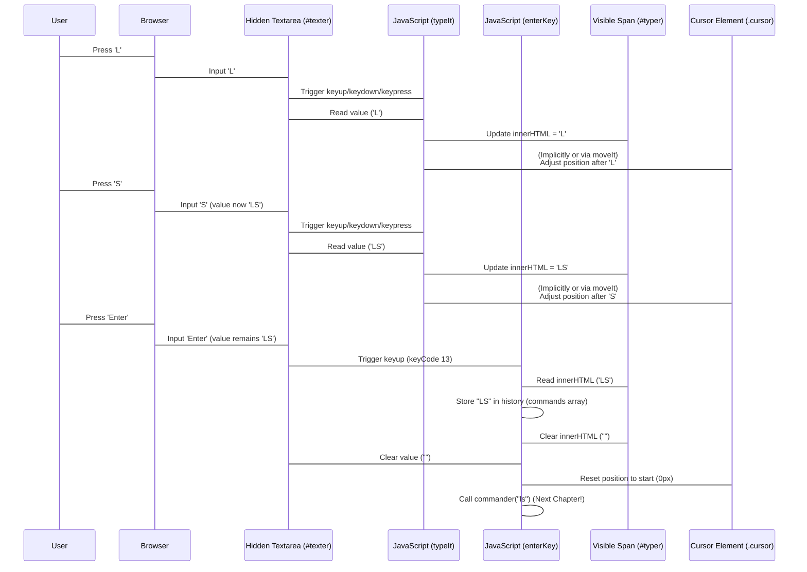

# Chapter 2: User Input & Typing Handler

Welcome back! In the previous chapter, [Terminal Core UI](01_terminal_core_ui_.md), we set the stage. We built the basic visual container – the dark screen, the prompt line, and the blinking cursor. But right now, it's just a static picture. You can't actually *type* anything into it.

This is where the "User Input & Typing Handler" comes in! It's the system that listens to your keyboard, makes the characters you type appear on the screen, and handles special keys like Enter or the arrow keys to navigate through past commands. It breathes life into the visual shell we created.

## What is the User Input & Typing Handler?

Think about typing in a real terminal. You press 'L', an 'L' appears. You press 'S', an 'S' appears next to it. The cursor moves. You press Enter, the command runs, and new text appears below. This chapter is all about making that first part happen: **capturing what you type and showing it correctly on the screen.**

Its main responsibilities are:

1.  **Capturing Keystrokes:** Recognizing which keys you press.
2.  **Displaying Typed Characters:** Showing the characters you type right where the cursor is.
3.  **Moving the Cursor:** Making the blinking cursor follow the text you type.
4.  **Handling Special Keys:** Doing specific actions for keys like Enter (to run a command) or Up/Down arrows (to recall history).

Essentially, it's the bridge between your physical keyboard and the visual input line in our web terminal.

## The Trick: Hidden Textarea and Visible Span

As we hinted in Chapter 1, building a custom input line on the web is tricky. Standard HTML input fields don't give you fine-grained control over things like the cursor's appearance or inserting text with complex styling.

The `Rushi-Bashfolio` project uses a common technique to solve this:

*   A **hidden `<textarea>`**: This element (`#texter`) is kept off-screen. Its job is purely to **capture** all the keyboard input reliably. Browsers are excellent at handling text input in `<textarea>`s, including tricky parts like copy/paste, selection, and recognizing all key presses.
*   A **visible `<span>`**: This element (`#typer`), inside the `#liner` div next to the `.cursor`, is where the **actual typed text is displayed**.
*   **JavaScript:** This is the glue that copies the text from the hidden `<textarea>` to the visible `<span>` and manages the cursor's position.

## Capturing and Displaying Your Typing

Let's look at the core JavaScript function that makes text appear as you type. This is handled primarily by the `typeIt` function in `js/caret.js`.

```javascript
// From js/caret.js (simplified)

var cursor; // We'll use this later for cursor movement
// ... other global variables ...

function typeIt(from, e) {
    e = e || window.event;
    var w = $("typer"); // Get the visible span element
    var tw = from.value; // Get the text from the hidden textarea

    // We check if it's NOT a password field (pw is a flag from main.js)
    if (!pw) {
        w.innerHTML = tw; // Copy the text from the textarea to the visible span
    }
    // (Password handling is skipped here for simplicity)
}

// ... moveIt function and others ...
```

**Explanation:**

1.  `typeIt(from, e)`: This function is called every time you press a key in the hidden `<textarea>` (look at the `onkeyup`, `onkeydown`, `onkeypress` attributes in the HTML for `#texter`).
2.  `from`: This refers to the `<textarea>` element itself (`#texter`).
3.  `$("typer")`: This gets the visible `<span>` element where the text is shown. (The `$` function is a simple helper defined in `js/caret.js` for `document.getElementById`).
4.  `from.value`: This accesses the current text content inside the hidden `<textarea>`.
5.  `w.innerHTML = tw;`: This is the core step! It takes the text from the hidden input (`tw`) and puts it inside the visible `<span>` (`w`), making it appear on the screen.

So, every time you type a character, the `<textarea>` captures it, this function runs, grabs the new text, and updates the visible area.

## Handling the Blinking Cursor

The blinking cursor (`<b class="cursor">`) is styled with CSS animation as seen in Chapter 1. However, its *position* needs to be managed by JavaScript to make it follow the text you type. The `moveIt` function in `js/caret.js` does this.

```javascript
// From js/caret.js (simplified)

var cursor; // Global variable to hold the cursor element

window.onload = init; // Call init when the page loads

function init() {
    cursor = $("cursor"); // Get the cursor element by its ID
    cursor.style.left = "0px"; // Set its initial position
}

function moveIt(count, e) {
    e = e || window.event;
    var keycode = e.keyCode || e.which;

    // Logic to move cursor based on arrow keys
    // (This original code estimates character width at 10px)
    if(keycode == 37) { // Left arrow key
        // Move left if not at the beginning
        // The original logic here checks bounds and moves by 10px
        // It might need adjustments depending on font/styling
        // For simplicity, imagine it just moves visually left.
    } else if (keycode == 39) { // Right arrow key
         // Move right if not at the end
         // Similar logic to move visually right by 10px.
    }
    // Note: The visual cursor doesn't perfectly match the hidden textarea's
    // internal cursor position in this simplified example, especially for
    // editing in the middle of a line. A more complex implementation
    // would synchronize them more closely.
}

function typeIt(from, e) {
    // ... (previous typeIt code) ...
    // After updating the text in the span, you might call moveIt here
    // to adjust the cursor based on the *current* text length,
    // or let onkeydown handle key-specific movements.
}
```

**Explanation:**

1.  `init()`: When the page loads, it finds the cursor element and sets its initial `left` CSS property.
2.  `moveIt(count, e)`: This function is called when a key is *pressed down* (`onkeydown` in the HTML).
3.  `keycode`: It checks which key was pressed.
4.  Arrow Key Logic: The code specifically looks for Left (37) and Right (39) arrow keys.
5.  `cursor.style.left = ...`: It modifies the `left` CSS property of the cursor element. By changing this value (e.g., by 10 pixels per character), it makes the cursor appear to move along the line.

While the `moveIt` function in the provided code snippet seems primarily focused on visual movement based on arrow keys and assumes a fixed character width (10px), a complete handler would also need to adjust the cursor position whenever new text is inserted or deleted to ensure it stays at the end of the line or the correct insertion point.

## Handling "Enter" and Command History

The most important special key is Enter. When you press Enter, you're telling the terminal you've finished typing your command and it's time to execute it. The `enterKey` function in `js/main.js` handles this.

It also handles the Up (38) and Down (40) arrow keys to cycle through previously entered commands, which is a standard terminal feature.

```javascript
// From js/main.js (simplified for input handling)

var command = document.getElementById("typer"); // The visible span
var textarea = document.getElementById("texter"); // The hidden textarea
var liner = document.getElementById("liner"); // The div holding prompt, span, cursor

var commands = []; // An array to store command history
var git = 0; // An index to track position in command history

window.addEventListener("keyup", enterKey); // Listen for key releases anywhere on the page

function enterKey(e) {
    e = e || window.event; // Get the event object

    // --- Handle Enter Key (e.keyCode == 13) ---
    if (e.keyCode == 13) {
        // 1. Get the command text
        let cmd = command.innerHTML; // Get text from the visible span
        commands.push(cmd); // Add command to history
        git = commands.length; // Reset history index to the end

        // 2. Prepare the command line for output (details in Output Rendering)
        // This part copies the prompt + typed command to the history area.
        // (Simplified: actual code uses addLine and checks currentDirectory)
        // addLine("Your command here", "no-animation", 0);

        // 3. Pass the command to the interpreter (details in Chapter 3)
        // commander(cmd.toLowerCase());

        // 4. Clear the input line
        command.innerHTML = ""; // Clear visible span
        textarea.value = ""; // Clear hidden textarea

        // (Password handling is skipped here)
    }

    // --- Handle Up Arrow Key (e.keyCode == 38) ---
    if (e.keyCode == 38 && git != 0) {
        git -= 1; // Move back in history
        textarea.value = commands[git]; // Put history command in textarea
        command.innerHTML = textarea.value; // Copy to visible span
    }

    // --- Handle Down Arrow Key (e.keyCode == 40) ---
    if (e.keyCode == 40 && git != commands.length) {
        git += 1; // Move forward in history
        if (commands[git] === undefined) {
             textarea.value = ""; // Clear if at the end of history
        } else {
            textarea.value = commands[git]; // Put history command in textarea
        }
        command.innerHTML = textarea.value; // Copy to visible span
    }

    // (Other key handlers skipped)
}
```

**Explanation:**

1.  `window.addEventListener("keyup", enterKey);`: This sets up a "listener" that waits for you to release a key *anywhere* on the page. When that happens, it calls the `enterKey` function.
2.  `e.keyCode == 13`: This checks if the key released was the Enter key.
3.  Inside the Enter block:
    *   It gets the typed command text from the `command` (which is the `#typer` span) and stores it in the `commands` array.
    *   It clears both the hidden `textarea` and the visible `span` to get ready for the next command.
    *   (It then calls `commander`, which is the [Command Interpreter](03_command_interpreter_.md) covered in the next chapter).
4.  `e.keyCode == 38`: This checks for the Up arrow key. If pressed, it moves backward through the `commands` array (`git -= 1`), loads the historical command into the `textarea.value`, and copies it to the visible `command.innerHTML` so you see it.
5.  `e.keyCode == 40`: This checks for the Down arrow key, moving forward through history.

## Putting it Together: The Flow

Here's a simple sequence diagram showing what happens when you type a few characters and then press Enter:



This diagram illustrates how the hidden textarea captures everything, JavaScript copies the text to the visible span, manages the cursor visually, and the Enter key triggers the clearing of the input line and prepares the command for processing.

## Key Elements for Input Handling

Here's a quick reminder of the key HTML elements involved in this process:

| HTML Element           | Role in Input Handling                                  |
| :--------------------- | :------------------------------------------------------ |
| `<textarea id="texter">` | **Captures all keyboard input.** Kept hidden off-screen. |
| `<span id="typer">`    | **Displays the typed characters.** Visible on the prompt line. |
| `<b class="cursor">`   | **The blinking cursor.** Its position is updated by JS.   |
| `<div id="liner">`     | Container holding the prompt, `#typer`, and `.cursor`. |

By using this hidden textarea / visible span pattern, the project gets the best of both worlds: reliable input capture and flexible custom display.

## Conclusion

In this chapter, we've seen how the `Rushi-Bashfolio` project captures your keyboard input and displays it on the screen, mimicking a real terminal. We learned about the clever use of a hidden `<textarea>` to capture input and JavaScript to mirror that text into a visible `<span>`. We also touched upon how the cursor's position is managed and how special keys like Enter and the arrow keys are handled to process commands and navigate history.

Now that we can capture and see the commands being typed, the next crucial step is to actually *understand* and *act upon* those commands. That's the job of the Command Interpreter!

Ready to make your terminal respond to commands like `help` or `projects`? Let's move on to the [Command Interpreter](03_command_interpreter_.md).

---

<sub><sup>Generated by [AI Codebase Knowledge Builder](https://github.com/The-Pocket/Tutorial-Codebase-Knowledge).</sup></sub> <sub><sup>**References**: [[1]](https://github.com/rushhiii/Rushi-Bashfolio/blob/2c56b548f807a8675557eebace56ffa498e2040c/index.html), [[2]](https://github.com/rushhiii/Rushi-Bashfolio/blob/2c56b548f807a8675557eebace56ffa498e2040c/js/caret.js), [[3]](https://github.com/rushhiii/Rushi-Bashfolio/blob/2c56b548f807a8675557eebace56ffa498e2040c/js/main.js)</sup></sub>
