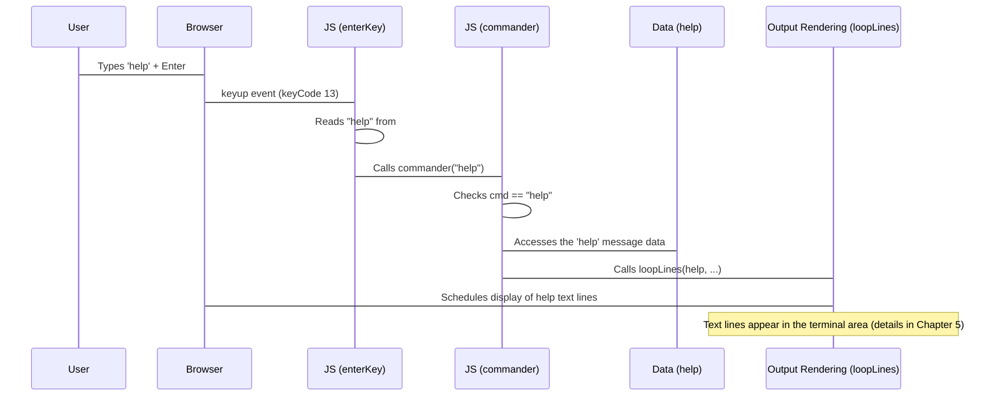

# Chapter 3: Command Interpreter

Welcome back to building your Bashfolio! In the previous chapter, [User Input & Typing Handler](02_user_input___typing_handler_.md), we learned how the website captures your typing and displays it on the screen, complete with a blinking cursor. You can now type commands like `help` or `whoami`.

But if you hit Enter right now, nothing happens (or maybe you get a "command not found" message!). That's because the website doesn't yet *understand* what you typed. It needs a "brain" to process your input.

This is where the **Command Interpreter** comes in!

## What is the Command Interpreter?

Imagine you're speaking to someone in a different language. You need a translator to understand what you're saying and tell the other person what action to take. The Command Interpreter plays this role in our web terminal:

*   It **receives** the text you typed and hit Enter on (from the [User Input & Typing Handler](02_user_input___typing_handler_.md)).
*   It **translates** that text, figuring out which command you meant (`help`, `whoami`, `projects`, etc.).
*   It **dispatches** the request, telling the rest of the system what needs to happen (like displaying the help text or opening a link).

It's the crucial step between *typing* a command and seeing its *result*.

## The Core Task: Understanding and Acting

Let's think about a simple use case: You want to see the list of available commands. You know you should type `help`.

1.  You type `help`. ([User Input & Typing Handler](02_user_input___typing_handler_.md) handles this).
2.  You press Enter. ([User Input & Typing Handler](02_user_input___typing_handler_.md) detects this).
3.  The typed text `"help"` needs to be processed. **This is the Command Interpreter's job!**
4.  The Interpreter recognizes `"help"` as a valid command.
5.  The Interpreter triggers the action associated with `help` (displaying the help text).

So, the central job is taking a string of text and deciding which predefined action to perform.

## Where the Interpreter Lives: The `commander()` Function

In the `Rushi-Bashfolio` project, the main logic for interpreting commands is found in the `commander()` function within the `js/main.js` file.

Recall from Chapter 2, when the Enter key is pressed, the `enterKey` function gets the text you typed and then calls `commander()` with that text.

Here's a simplified look at the relevant part of `enterKey`:

```javascript
// From js/main.js (simplified)
var command = document.getElementById("typer"); // The visible span

function enterKey(e) {
    e = e || window.event;

    if (e.keyCode == 13) { // If Enter key is pressed
        let cmd = command.innerHTML; // Get the typed text
        // ... (history storage and clearing input handled here) ...

        commander(cmd.toLowerCase()); // *** Call the interpreter! ***
    }
    // ... (Arrow key history navigation handled here) ...
}
```

This snippet shows that the `enterKey` function takes the text from the visible `#typer` span, converts it to lowercase (`cmd.toLowerCase()`) to make commands case-insensitive (so `HELP`, `Help`, and `help` all work), and then passes it directly to the `commander` function.

## How the Interpreter Works: The `switch` Statement

Inside the `commander()` function, the project uses a `switch` statement. This is a programming structure that's perfect for checking a single value (our command string) against a list of possible values (the known commands).

Here's a simplified version of the `commander` function, focusing only on how it handles the `help` command and what happens if a command isn't recognized:

```javascript
// From js/main.js (simplified commander function)

// Assume 'help' is an array containing the lines of text for the help message
// This data is defined elsewhere, likely in js/data.js (details in Chapter 4)
// Example: var help = ["List of commands:", "- help", "- whoami", "..."];

function commander(cmd) {
    switch (cmd) {
        case "help":
            // If the command is "help"...
            loopLines(help, "color2 margin", 80); // Trigger displaying the help text
            break; // Stop checking other cases

        // ... other command cases would go here (e.g., case "whoami": ...)

        default:
            // If the command doesn't match any 'case' above...
            addLine("<span class=\"inherit\">Command not found. For a list of commands, type <span class=\"command\">'help'</span>.</span>", "error", 100);
    }
}

// addLine() and loopLines() are functions that handle displaying output
// (Details covered in Chapter 5: Output Rendering Engine)
```

**Explanation:**

1.  `function commander(cmd)`: This defines the function that receives the command string (`cmd`) from `enterKey`.
2.  `switch (cmd)`: This starts the switch statement, telling the program to look at the value of the `cmd` variable.
3.  `case "help":`: This is the first check. If `cmd` is exactly equal to `"help"`, the code inside this block runs.
4.  `loopLines(help, "color2 margin", 80);`: This line is the *action* for the `help` command. It calls another function (`loopLines`) which is responsible for taking the data stored in the `help` variable (the lines of text for the help message) and displaying them in the terminal output area with specific styling and animation delay. (We'll cover `loopLines` and `addLine` in detail in [Output Rendering Engine](05_output_rendering_engine_.md), and the `help` data in [Command Output Data](04_command_output_data_.md)).
5.  `break;`: This keyword is important! It tells the `switch` statement to stop checking other cases once a match is found.
6.  `default:`: If the `cmd` value doesn't match *any* of the `case` values (`"help"`, `"whoami"`, etc.), the code inside the `default` block runs.
7.  `addLine("<span ...>Command not found...</span>", "error", 100);`: This is the default action. It uses the `addLine` function to display the standard "Command not found" message with specific styling (`"error"`) and a small delay.

This `switch` statement is the core logic of the Command Interpreter. It's a simple yet effective way to map typed commands to specific functions or actions. Each `case` represents a command the terminal understands.

## Example Flow: Typing `help`

Let's trace the path of typing `help` and pressing Enter, focusing on the interpreter's role:



This diagram shows how the typed command travels from the input handler (`enterKey`) to the interpreter (`commander`), which then decides what data is needed (`help` data) and tells the output system (`loopLines`) to display it.

## Key Components of the Interpreter

Let's list the main pieces we discussed:

| Component             | Role in Command Interpretation                                   | Location          |
| :-------------------- | :--------------------------------------------------------------- | :---------------- |
| `enterKey` function   | Receives keyboard input, extracts the command string.            | `js/main.js`      |
| `commander` function  | The main interpreter function; receives the command string.      | `js/main.js`      |
| `switch (cmd)`        | Checks the command string against known cases.                 | Inside `commander` |
| `case "command":`     | Matches a specific command string (e.g., `"help"`).            | Inside `switch`   |
| Code inside `case`    | The action to perform for a matching command (e.g., call `loopLines`). | Inside `case`     |
| `default:` block      | Handles commands that don't match any known case.                | Inside `switch`   |

The `commander` function, driven by the `switch` statement, is the heart of the interpreter, connecting user input to specific actions.

## Conclusion

In this chapter, we've explored the **Command Interpreter**, the essential part of the `Rushi-Bashfolio` project that understands the commands you type. We learned how the `enterKey` function passes your input to the `commander()` function, and how the `switch` statement inside `commander()` checks for known commands like `help`. We saw that when a command is recognized, it triggers a specific action, such as calling `loopLines` to display information. If the command isn't recognized, a friendly "Command not found" message is shown.

Now that the interpreter can figure out *what* command you want, the next step is understanding the *information* it needs to display. In the next chapter, we'll look at how the project stores and manages the data that makes up command outputs, like the help message, project lists, or social links.

Ready to explore the data behind the commands? Let's move on to [Command Output Data](04_command_output_data_.md).

---

<sub><sup>Generated by [AI Codebase Knowledge Builder](https://github.com/The-Pocket/Tutorial-Codebase-Knowledge).</sup></sub> <sub><sup>**References**: [[1]](https://github.com/rushhiii/Rushi-Bashfolio/blob/2c56b548f807a8675557eebace56ffa498e2040c/js/main.js)</sup></sub>
