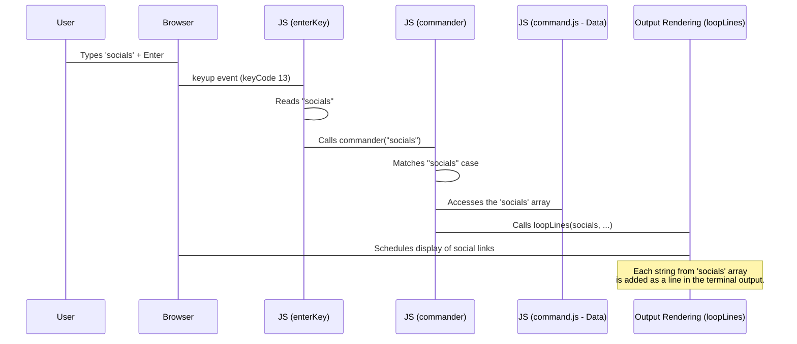

# Chapter 4: Command Output Data

Welcome back! In the last chapter, [Command Interpreter](03_command_interpreter_.md), we learned how the Bashfolio website's "brain" (`commander` function) receives the text you type and figures out *which* command you intended. For example, it knows that if you type `help`, you want to see the list of available commands.

But where does the *actual list* of commands come from? Where is the text for the `whoami` description stored? How does the `neofetch` command know what ASCII art and system info to display?

This is where the **Command Output Data** comes in!

## What is Command Output Data?

Think of Command Output Data as the **script** or the **database** that the terminal uses to look up the information it needs to display for each command.

When the [Command Interpreter](03_command_interpreter_.md) identifies a command (like `help`), it doesn't *generate* the output text on the spot. Instead, it goes to this data storage, finds the predefined text or structure associated with that command, and then passes it along to be shown on the screen.

Its main purpose is to:

1.  **Store all predefined content:** This includes text for "about me", social links, project lists, help messages, and even the cool ASCII art images.
2.  **Separate content from logic:** The interpreter knows *what* to do, the output data provides the *content* to display. This makes it easier to change the content without changing the core logic.

It's the library of responses the terminal can give.

## Where is the Data Stored?

In the `Rushi-Bashfolio` project, most of the Command Output Data is stored directly in JavaScript variables within the `js/command.js` file.

Let's look at the `help` command's output data as our main example. If you open `js/command.js`, you'll find a section like this:

```javascript
// From js/command.js (simplified)

// ... (other variables like youtube, twitter, etc.) ...

help = [
    "GNU bash, version 5.2.21(1)-release (x86_64-pc-linux-gnu)",
    "These shell commands are defined internally.  Type 'help' to see this list.",
    "<br>", // This creates a blank line
    '<span class="command">help</span>          <a style="color: #ffffff">Displays available commands and their usage.</a>',
    '<span class="command">whois</span>         <a style="color: #ffffff">Provides information about a user or domain.</a>',
    // ... many other command descriptions ...
    '<span class="command">exit</span>          <a style="color: #ffffff">type this command to exit the bashfolio website</a>',
    "<br>"
];

// ... (other data variables like whois, socials, projects, banner, neofetch, etc.) ...
```

**Explanation:**

1.  `help = [...]`: This declares a JavaScript variable named `help`. The square brackets `[]` mean it's an **array**, which is like a list or a sequence of items.
2.  `"..."`: Each item in the array is a **string** (text enclosed in quotes). In this case, each string represents a single line of output that the `help` command should display.
3.  `<br>`, `<span>`, `<a>`: Notice that some strings contain HTML tags! This is a powerful feature. The output rendering engine (which we'll cover in the next chapter) understands HTML, so you can include tags directly in your data to add styling (like colored text using `<span>` or `<a>` with `style` attributes) or even make parts of the output clickable links (`<a>`).

So, the entire help message is just a list of strings stored in the `help` variable, ready to be displayed line by line.

## How the Interpreter Uses the Data

Now, let's see how the [Command Interpreter](03_command_interpreter_.md) connects to this data. Recall the `commander` function from the previous chapter:

```javascript
// From js/main.js (simplified commander function)

// Assume 'help' variable from js/command.js is available here

function commander(cmd) {
    switch (cmd) {
        case "help":
            // When the command is "help", it uses the 'help' data
            loopLines(help, "color2 margin", 80); // Pass the 'help' array here
            break;

        // ... other command cases ...

        default:
            // Default case for unknown commands
            addLine("<span class=\"inherit\">Command not found...</span>", "error", 100);
            break;
    }
}

// addLine() and loopLines() are part of the Output Rendering Engine (Chapter 5)
```

**Explanation:**

When the `cmd` variable (which holds the typed command, like `"help"`) matches the `"help"` case in the `switch` statement, the code inside that `case` block runs. The crucial part is `loopLines(help, "color2 margin", 80);`. This line calls a function `loopLines` (which handles displaying the output, details in [Output Rendering Engine](05_output_rendering_engine_.md)), and it passes the *entire `help` array* as the first argument.

This is the connection! The interpreter finds the right "script" (the `help` array) for the command and hands it over to the display system.

## Example: The `socials` Data

Let's look at another example from `js/command.js`, the `socials` data:

```javascript
// From js/command.js (simplified)

var youtube = "https://www.youtube.com/";
// ... (other social links) ...

socials = [
    "SHORT DESCRIPTION:",
    "       <a style='color: #ffffff'>These are my analogous social accounts and non-coordinated accounts.</a>",
    "<br>",
    // Using the variables defined earlier to create links
    ' ▶ YouTube:                            - <a href="' + youtube + '" target="_blank">youtube/@rushhiii</a>',
    ' 𝕏 Twitter:                            - <a href="' + twitter + '" target="_blank">twitter/@rushhiii</a>',
    // ... other social links ...
    "<br>"
];
```

This `socials` variable is another array of strings. It includes plain text lines, a blank line (`<br>`), and lines containing `<a>` tags that use the `youtube`, `twitter`, etc., variables (defined earlier in the same file) to create clickable links that open in a new tab (`target="_blank"`).

When the `commander` function receives `"socials"`, it would likely have a case like `case "socials": loopLines(socials, "some-style", 50); break;`, passing the `socials` array to `loopLines`.

## ASCII Art Data

Even the complex ASCII art images are stored as multi-line strings within these data arrays. For example, the `neofetch` command's output is defined like this:

```javascript
// From js/command.js (simplified, showing one version)

neofetch = [
  "<pre>" + `
 
           .-/+oossssoo+/-.               
        ':+ssssssssssssssssss+:'           
      -+ssssssssssssssssssyyssss+-         
    .ossssssssssssssssss<a style='color: #ffffff'>dMMMNy</a>sssso.       <a style='color: #ffffff'>bezehel@k.@rushhiii</a> 
   /sssssssssss<a style='color: #ffffff'>hdmmNNmmyNMMMMh</a>ssssss/      -----------------------
  +sssssssss<a style='color: #ffffff'>hmydMMMMMMMNddddy</a>ssssssss+     
 // ... many more lines of ASCII art ...
                                           
    ` + "</pre>"
];

// Note: There are multiple neofetch variables (neofetch1, neofetch2)
// The commander function likely picks one randomly or based on input.
```

Here, the entire ASCII art image (including potential inline styling or even an image tag) is stored as a single, very long string (or multiple strings concatenated) within a `<pre>` tag. The `<pre>` tag is important because it tells the browser to preserve the whitespace and line breaks exactly as they appear in the code, which is essential for ASCII art to display correctly.

## How the Data is Used (Simple Flow)

Here's a simplified view of the flow when a command needs output data, like typing `socials`:



This shows that the data isn't actively *doing* anything until the interpreter tells the output engine to use it.

## Key Data Variables

Here are some of the main variables in `js/command.js` that hold the command output data:

| Variable Name | Purpose                                       | Used by Command |
| :------------ | :-------------------------------------------- | :-------------- |
| `help`        | List of available commands and descriptions   | `help`          |
| `whois`       | "About Me" text                               | `whois`         |
| `whoami`      | Current user information                      | `whoami`        |
| `socials`     | Links to social media profiles                | `socials`       |
| `projects`    | List and links to projects                    | `projects`      |
| `banner`      | The large welcome banner (ASCII art + text)   | `banner` (likely called on page load) |
| `neofetch`, `neofetch1`, `neofetch2` | Different versions of Neofetch-style system info ASCII art | `neofetch` |
| `asciiart`    | List of available ASCII art categories/commands | `asciiart`    |
| `religion`, `computer`, `music`, `mythology`, etc. | Lists of commands within ASCII art categories | `asciiart`, etc. |
| `heaven`, `grail`, `computer1`, `pubg`, etc. | The actual ASCII art strings | Various (e.g., `heaven`, `pubg`) |
| `sudo`, `sudo_apt_update`, etc. | Simulated output for `sudo` commands | `sudo`, `sudo_apt_update`, etc. |

These variables collectively form the content base for almost everything the terminal displays.

## Conclusion

In this chapter, we've explored the Command Output Data – the collection of predefined text, links, and ASCII art that the `Rushi-Bashfolio` terminal uses to respond to commands. We saw that this data is primarily stored in JavaScript arrays in `js/command.js`, using strings that can even include HTML for styling and interactivity. We learned how the [Command Interpreter](03_command_interpreter_.md) selects the appropriate data array for a given command and passes it to the next part of the system: the Output Rendering Engine.

Now that the interpreter knows *what* command was typed and the data knows *what* to say, the final piece is actually putting that information onto the screen with the correct look and feel.

Ready to see how this data is beautifully displayed, line by line? Let's move on to the [Output Rendering Engine](05_output_rendering_engine_.md).

---

<sub><sup>Generated by [AI Codebase Knowledge Builder](https://github.com/The-Pocket/Tutorial-Codebase-Knowledge).</sup></sub> <sub><sup>**References**: [[1]](https://github.com/rushhiii/Rushi-Bashfolio/blob/2c56b548f807a8675557eebace56ffa498e2040c/js/command.js)</sup></sub>
