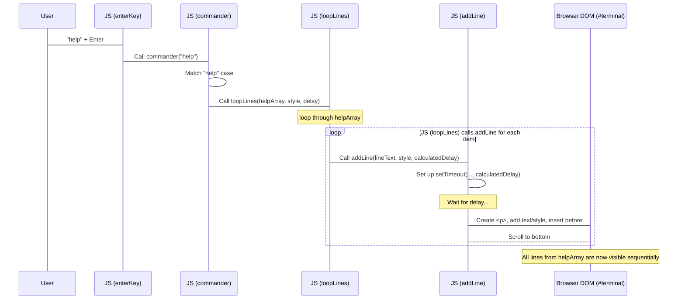

# Chapter 5: Output Rendering Engine

Welcome back to the `Rushi-Bashfolio` tutorial! In our journey so far, we've built the visual shell ([Terminal Core UI](01_terminal_core_ui_.md)), learned how to capture your typing ([User Input & Typing Handler](02_user_input___typing_handler_.md)), and understood how the website figures out which command you want to run ([Command Interpreter](03_command_interpreter_.md)). In the last chapter, [Command Output Data](04_command_output_data_.md), we saw where all the pre-written responses, like the `help` text or project lists, are stored.

Now comes the exciting part: taking that data and making it appear on the screen in a cool, terminal-like way! This is the job of the **Output Rendering Engine**.

## What is the Output Rendering Engine?

Think of the Output Rendering Engine as the terminal's **printer or display driver**. It receives the text (the Command Output Data) that the [Command Interpreter](03_command_interpreter_.md) wants to show and is responsible for:

1.  **Displaying it Visually:** Putting the text onto the web page, specifically within the `#terminal` area we set up in Chapter 1.
2.  **Line by Line:** Making sure each item in the data array (which often represents a line) appears on its own line.
3.  **Adding Style:** Applying the correct colors and formatting (like those specified in the data itself using HTML, or via CSS classes).
4.  **Adding Animation:** Creating the effect that the text is being "typed" onto the screen, line by line, with a small delay between each line appearing.

Its main goal is to take raw text data and turn it into a dynamic, styled output that looks like it's appearing in a real terminal.

## The Core Task: Showing Data on Screen

Let's revisit our `help` command example.
1.  You type `help`.
2.  The [User Input & Typing Handler](02_user_input___typing_handler_.md) captures it.
3.  The [Command Interpreter](03_command_interpreter_.md) (`commander` function) recognizes `"help"`.
4.  The Interpreter looks up the `help` array (from [Command Output Data](04_command_output_data_.md)).
5.  **The Output Rendering Engine takes this `help` array and displays each line on the screen.** This is the step we're focusing on now!

The engine needs to display the first line, wait a moment, display the second line, wait, and so on, until all lines from the `help` array are shown.

## How it Works: `addLine` and `loopLines`

The Output Rendering Engine relies primarily on two helper functions in `js/main.js`:

*   `addLine(text, style, time)`: This function is responsible for adding *a single line* of text to the terminal's history display after a specified delay.
*   `loopLines(name, style, time)`: This function takes an *array* of lines (like our `help` array) and calls `addLine` for each item in the array, managing the delay between lines.

The [Command Interpreter](03_command_interpreter_.md) typically calls `loopLines`, passing it the data array (e.g., `help`, `socials`, `projects`) and the desired delay between lines.

## Using the Engine: From Interpreter to Display

Let's look again at how the `commander` function (the interpreter) uses `loopLines`:

```javascript
// From js/main.js (simplified commander function)

// 'help' is the array of lines from js/command.js
// 'loopLines' and 'addLine' are defined later in js/main.js

function commander(cmd) {
    switch (cmd.toLowerCase()) {
        case "help":
            // When command is "help", call loopLines with the 'help' data array
            loopLines(help, "color2 margin", 80);
            break;

        // ... other command cases ...

        default:
            // For unknown commands, just add a single error line
            addLine("<span class=\"inherit\">Command not found...</span>", "error", 100);
            break;
    }
}
```

As you can see, the `commander` function doesn't display the lines itself. It delegates that task to `loopLines`, giving it the `help` array, some styling information (`"color2 margin"`), and a timing value (`80`, likely milliseconds per character or per line).

For the "Command not found" message, since it's just a single line, the `commander` function directly calls `addLine`.

## Internal Implementation: The `addLine` Function

The `addLine` function is the fundamental building block. It takes one piece of text and adds it to the output area.

Here's a simplified version:

```javascript
// From js/main.js (simplified addLine function)

// 'before' is the element just before the input line,
// new output lines are inserted before it.
var before = document.getElementById("before");

function addLine(text, style, time) {
    // Use setTimeout to make the line appear after 'time' milliseconds
    setTimeout(function () {
        var next = document.createElement("p"); // Create a new paragraph element for the line
        next.innerHTML = text; // Put the line's text inside the paragraph
        next.className = style; // Add CSS classes for styling

        // Insert the new line into the HTML, just before the 'before' element
        before.parentNode.insertBefore(next, before);

        // Scroll the window down so the new line is visible
        window.scrollTo(0, document.body.offsetHeight);
    }, time); // This is the delay before this line appears
}
```

**Explanation:**

1.  `function addLine(text, style, time)`: Takes the text content, a string of CSS class names, and a delay in milliseconds.
2.  `setTimeout(function() { ... }, time)`: This is key! It schedules the code inside the function to run *after* `time` milliseconds have passed. This is how the delay and the typing animation effect (line by line) are achieved.
3.  `document.createElement("p")`: Creates a new HTML `<p>` (paragraph) element. Output lines are typically put in `<p>` tags.
4.  `next.innerHTML = text`: Sets the content of the new `<p>` tag to the `text` provided. Remember, this text can include HTML like `<br>`, `<span>`, or `<a>` from the data!
5.  `next.className = style`: Applies the specified CSS classes (like `"color2 margin"` or `"error"`) to the `<p>` tag. These classes control the appearance (color, spacing, etc.).
6.  `before.parentNode.insertBefore(next, before)`: This complex line simply means: find the parent element of `before` (which is `#terminal`), and insert the `next` element (our new `<p>`) right *before* the `before` element. Since `before` is just before the input line, this adds the output line to the history above the current prompt.
7.  `window.scrollTo(...)`: After adding a line, this scrolls the browser window down to the bottom, ensuring you always see the latest output and the input prompt.

There's also a small loop at the start of the original `addLine` function that handles replacing double spaces with `&nbsp;&nbsp;` to maintain spacing in the output, which is common in terminals.

## Internal Implementation: The `loopLines` Function

The `loopLines` function orchestrates calling `addLine` for an entire array of lines.

```javascript
// From js/main.js (simplified loopLines function)

// addLine is defined above it

function loopLines(name, style, time) {
    // Loop through each item (line) in the 'name' array
    name.forEach(function (item, index) {
        // For each item, call addLine
        // The delay for each line is its index in the array * the base 'time' delay
        addLine(item, style, index * time);
    });
}
```

**Explanation:**

1.  `function loopLines(name, style, time)`: Takes an array (`name`), a style string, and a base time delay.
2.  `name.forEach(function (item, index) { ... });`: This is a standard JavaScript way to loop through an array. For each element in the `name` array, the function inside is executed.
3.  `item`: Represents the current line text from the array.
4.  `index`: Represents the position of the current line in the array (0 for the first line, 1 for the second, etc.).
5.  `addLine(item, style, index * time)`: This is where the magic happens for animation. It calls `addLine` for the current `item` (the line text) and `style`, but calculates the delay as `index * time`.
    *   First line (index 0): `addLine(..., 0 * time)` -> appears almost instantly.
    *   Second line (index 1): `addLine(..., 1 * time)` -> appears after `time` milliseconds.
    *   Third line (index 2): `addLine(..., 2 * time)` -> appears after `2 * time` milliseconds.
    *   And so on...

This calculated delay makes each line appear sequentially, creating the typing animation effect line by line.

## Styling and Animation Details

The `style` parameter in `addLine` and `loopLines` corresponds to CSS classes. For example, `loopLines(help, "color2 margin", 80)` will add the classes `color2` and `margin` to each `<p>` element created for the help text lines.

```css
/* Simplified CSS examples from a theme file */
.color2 {
    color: #9fffb3; /* Example color */
}

.margin {
    margin-bottom: 5px; /* Example spacing */
}

/* Styling for the paragraph elements holding output lines */
p {
    /* ... display, line-height, margin etc. (from Chapter 1) ... */
    overflow: hidden;
    white-space: normal;
    letter-spacing: 0.05em;
    /* This is where the typing animation might be applied */
    /* animation: typing 4s steps(40, end); example */
    /* This specific project might rely more on the addLine delay */
    /* for the "typing" feel rather than a CSS animation on the text itself */
}
```
The styling applied via CSS classes (from Chapter 1 and [Theme Management](06_theme_management_.md)) determines the font, color, and layout of the output lines. The *timing* of when each line appears is controlled by the `time` parameter and `setTimeout` in the JavaScript functions.

The CSS `p` style shown in Chapter 1 included comments about a "typing animation". In this project's specific implementation using `addLine` and `loopLines`, the "typing animation" effect is primarily created by the **staggered delay** between adding each *complete* line to the DOM, making it look like the terminal is printing line by line. While CSS could potentially animate characters within a line, the provided code focuses on the line-by-line appearance timing.

## Flow: Displaying the Help Output

Here's how the parts connect when you type `help` and the output engine does its job:


This diagram shows that the interpreter hands the data array to `loopLines`, which then iterates through it, scheduling each line to be added to the visible terminal area (`#terminal`) by calling `addLine` with increasing delays.

## Key Components of the Output Rendering Engine

Let's summarize the pieces involved in displaying output:

| Component                   | Role in Output Rendering                                    | Location          |
| :-------------------------- | :---------------------------------------------------------- | :---------------- |
| `addLine` function          | Adds a single line of text to the terminal history.         | `js/main.js`      |
| `loopLines` function        | Iterates through an array of lines, calling `addLine` for each with staggered delays. | `js/main.js`      |
| `time` / `delay` parameters | Controls the speed/timing of the line-by-line appearance. | `addLine`, `loopLines` |
| `style` parameter           | Passes CSS class names for styling the output line.         | `addLine`, `loopLines` |
| `<a id="before">`           | A placeholder element to insert new output lines before.    | `index.html`      |
| `<div id="terminal">`       | The main container where output lines are added.          | `index.html`      |
| `<p>` elements              | The HTML tags used to wrap individual output lines.         | Created by `addLine` |
| CSS Styles (`.color2`, `.margin`, `p`) | Define the visual appearance of the output text.      | CSS files (themes) |

These components work together to take the command output data and display it correctly styled and timed in the web terminal interface.

## Conclusion

In this chapter, we've explored the **Output Rendering Engine** – the part of the `Rushi-Bashfolio` project that makes command results visible on the screen. We learned about the two main functions, `addLine` for adding single lines and `loopLines` for handling arrays of lines with staggered delays, creating the line-by-line typing effect. We saw how these functions use `setTimeout` to control timing and CSS classes (managed by the `style` parameter) to control appearance. By understanding `addLine` and `loopLines`, you now know how the data from `js/command.js` is transformed into the dynamic output you see in the terminal.

The appearance of this output is also heavily influenced by the terminal's overall look and feel, including its color scheme. In the next chapter, we'll dive into how the `Rushi-Bashfolio` project manages different visual themes.

Ready to change the look of your terminal? Let's move on to [Theme Management](06_theme_management_.md).

---

<sub><sup>Generated by [AI Codebase Knowledge Builder](https://github.com/The-Pocket/Tutorial-Codebase-Knowledge).</sup></sub> <sub><sup>**References**: [[1]](https://github.com/rushhiii/Rushi-Bashfolio/blob/2c56b548f807a8675557eebace56ffa498e2040c/js/main.js)</sup></sub>
