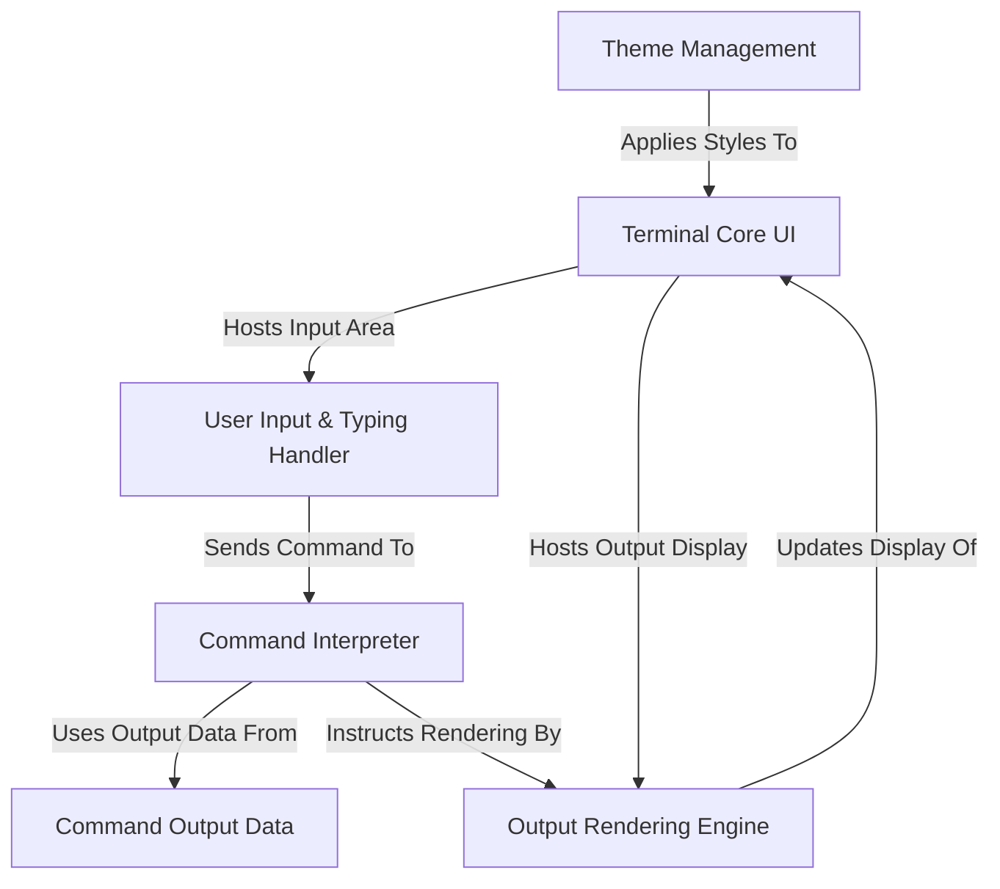

# Tutorial: Rushi-Bashfolio

This project is a unique *portfolio website* that **simulates a command-line terminal**.
Users can type *commands* to explore information, which an *interpreter* processes using *predefined data*.
The results are shown on the screen with a *typing animation*, and the appearance can be customized with different *themes*.

## Visual Overview

## Chapters

1. [Terminal Core UI
](01_terminal_core_ui_.md)
2. [User Input & Typing Handler
](02_user_input___typing_handler_.md)
3. [Command Interpreter
](03_command_interpreter_.md)
4. [Command Output Data
](04_command_output_data_.md)
5. [Output Rendering Engine
](05_output_rendering_engine_.md)
6. [Theme Management
](06_theme_management_.md)

---

Generated by [AI Codebase Knowledge Builder](https://github.com/The-Pocket/Tutorial-Codebase-Knowledge).
